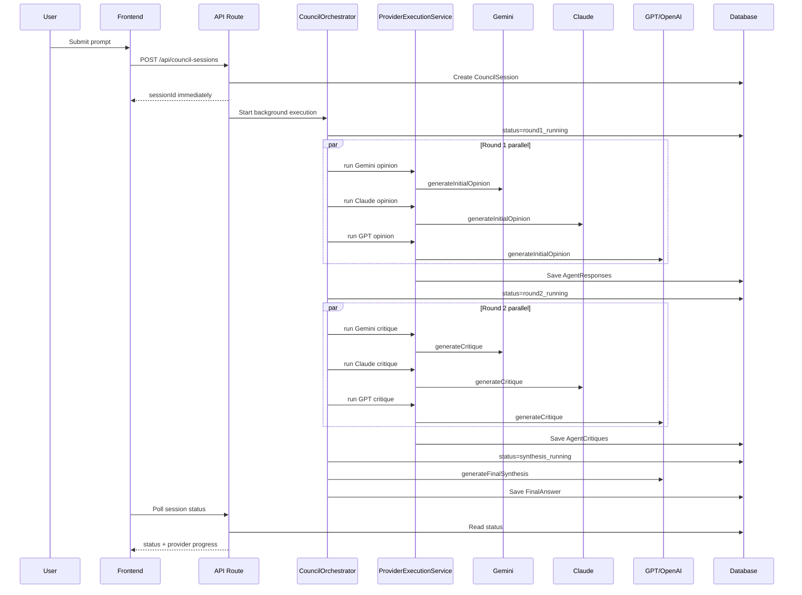

# Sequence Diagram

```mermaid
sequenceDiagram
    participant U as User
    participant FE as Frontend
    participant API as API Route
    participant OR as CouncilOrchestrator
    participant EX as ProviderExecutionService
    participant G as Gemini
    participant C as Claude
    participant O as GPT/OpenAI
    participant DB as Database

    U->>FE: Submit prompt
    FE->>API: POST /api/council-sessions
    API->>DB: Create CouncilSession
    API-->>FE: sessionId immediately

    API->>OR: Start background execution
    OR->>DB: status=round1_running

    par Round 1 parallel
      OR->>EX: run Gemini opinion
      EX->>G: generateInitialOpinion
      OR->>EX: run Claude opinion
      EX->>C: generateInitialOpinion
      OR->>EX: run GPT opinion
      EX->>O: generateInitialOpinion
    end

    EX->>DB: Save AgentResponses
    OR->>DB: status=round2_running

    par Round 2 parallel
      OR->>EX: run Gemini critique
      EX->>G: generateCritique
      OR->>EX: run Claude critique
      EX->>C: generateCritique
      OR->>EX: run GPT critique
      EX->>O: generateCritique
    end

    EX->>DB: Save AgentCritiques
    OR->>DB: status=synthesis_running
    OR->>O: generateFinalSynthesis
    OR->>DB: Save FinalAnswer

    FE->>API: Poll session status
    API->>DB: Read status
    API-->>FE: status + provider progress
```
