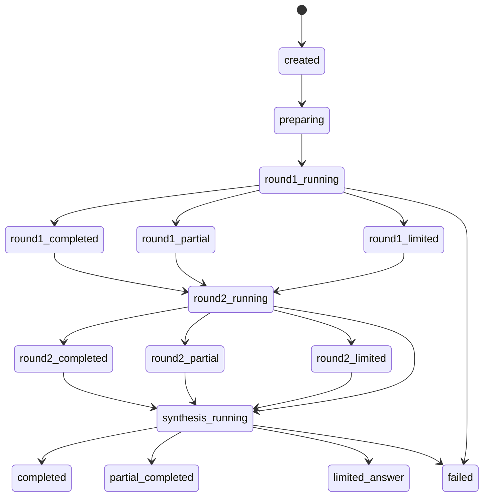

# State Machine

See also `docs/21_meeting_state_machine.md`.

```mermaid
stateDiagram-v2
    [*] --> created
    created --> preparing
    preparing --> round1_running
    round1_running --> round1_completed
    round1_running --> round1_partial
    round1_running --> round1_limited
    round1_running --> failed

    round1_completed --> round2_running
    round1_partial --> round2_running
    round1_limited --> round2_running

    round2_running --> round2_completed
    round2_running --> round2_partial
    round2_running --> round2_limited
    round2_running --> synthesis_running

    round2_completed --> synthesis_running
    round2_partial --> synthesis_running
    round2_limited --> synthesis_running

    synthesis_running --> completed
    synthesis_running --> partial_completed
    synthesis_running --> limited_answer
    synthesis_running --> failed
```
