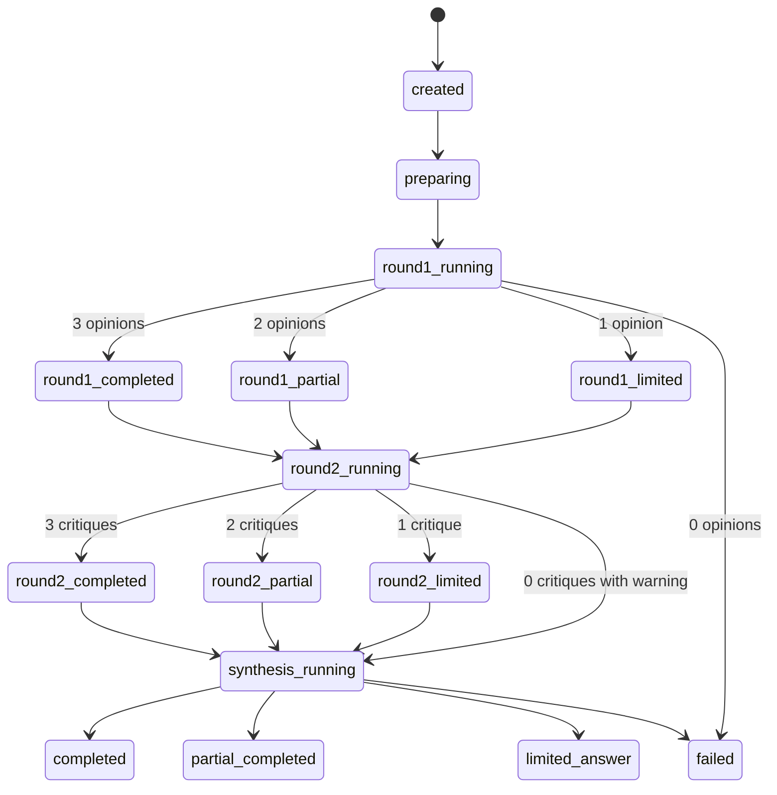

# 21. Meeting State Machine

## 상태 정의

```text
created
preparing
round1_running
round1_completed
round1_partial
round1_limited
round2_running
round2_completed
round2_partial
round2_limited
synthesis_running
completed
partial_completed
limited_answer
failed
```

---

## 상태 전이

```text
created
  ↓
preparing
  ↓
round1_running
  ├─ 3 opinions succeeded → round1_completed
  ├─ 2 opinions succeeded → round1_partial
  ├─ 1 opinion succeeded  → round1_limited
  └─ 0 opinions succeeded → failed

round1_completed / round1_partial / round1_limited
  ↓
round2_running   (round1_limited 도 degraded critique 시도로 진입한다)
  ├─ 3 critiques succeeded → round2_completed
  ├─ 2 critiques succeeded → round2_partial
  ├─ 1 critique succeeded  → round2_limited
  └─ 0 critiques succeeded → synthesis_running with warning

round2_completed / round2_partial / round2_limited
  ↓
synthesis_running
  ├─ synthesis succeeded with 3 providers → completed
  ├─ synthesis succeeded with partial providers → partial_completed
  ├─ synthesis from limited evidence → limited_answer
  └─ synthesis failed → failed or fallback_summary
```

---

## Mermaid Diagram



---

## 주의

라운드 구조는 순차이지만, 각 라운드 내부 Provider 실행은 병렬입니다.

```text
Round sequence: sequential
Provider calls inside a round: parallel
```
